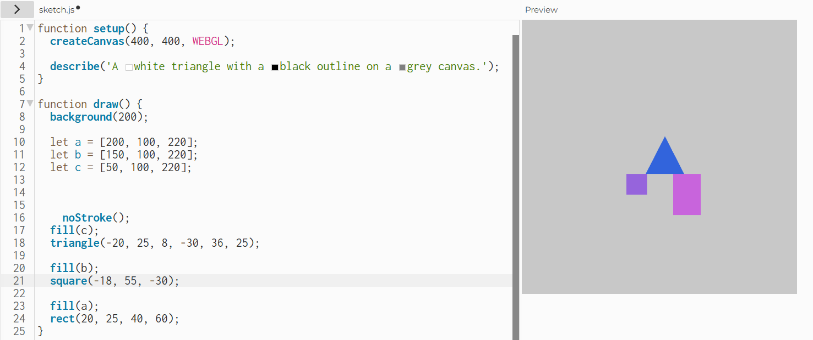
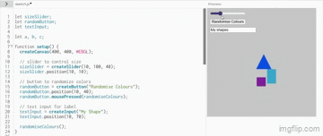
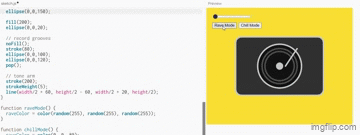
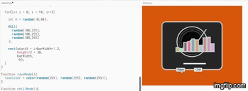
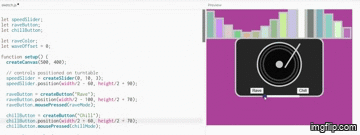
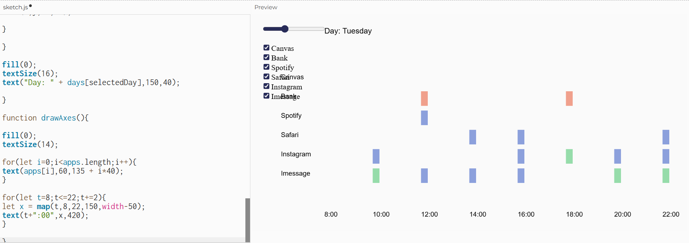
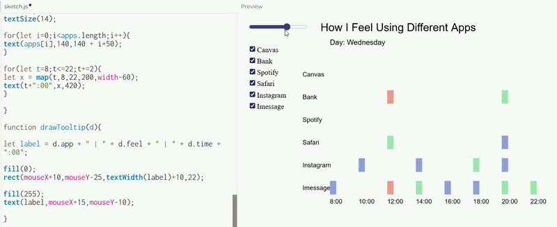
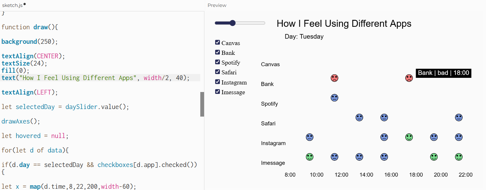

# Week 02

[← Back to Home](../index.md)

## Documentation 
## *Experiment 2: Interactivity*

**Activity 1: Drawing with Code**

For the next activity we had to get familiar with the p5.js editor. I created a simple composition using at least three different shapes.
I experimented with colour, size, and position. 

**Activity 2: Make an Interactive Sketch**

Using the DOM elements covered in class, createButton(), createSlider(), I created a sketch with at least two interactive controls that changes the size of the shapes, and a button that randomises the colours of the shapes.

**Activity 3: Vibe Code an Interactive Sketch**

Using an LLM (ChatGPT) I built a more ambitious interactive sketch in p5.js.
I described what I wanted in plain language, and pasted the results into the p5.js editor, and run the program. I decided to make something fun!

My first prompt to ChatGPT: "Create a p5.js sketch that resembles a turntable. Pressing buttons, moving "sliders" on the table etc, will change the colour and movement of the environment like you are in a rave."

Second prompt: "Please fix it so that the slider actually does something (right now moving it gives no effect) and position that slider, and all the other buttons it so that it is on the turntable. Include some fake audio visualizer bars."

Third prompt: "The slider still has no effect. Please make it that the slider changes the speed of the moving 'audio visualizer bars' as they are currently moving too quickly. Also please ensure the audio visualizer bars are above the turntable and not actually on it."

I was finally happy with this output, however I had to manually change the position of the 'rave' and 'chill' buttons, as they kept appearing below the turntable when I wanted them on it.

## Independent Study: Interactive Data Portrait

Taking the data I collected for Experiment 1 and use it as the basis for an interactive p5.js sketch, I tried to translate my hand-drawn data portrait into something a viewer could explore, control, or manipulate through interactive elements.

**Step 1: Translate your data drawing into code**

Looking at the data I collected by hand last week, I thought about how could I represent it in a p5.js sketch, and choose aspects of my data drawing that were most interesting to make interactive.

**Step 2: Design your interactive visualisation**

Next I created a p5.js sketch that includes interactive elements that allow the viewer to explore my data, using DOM elements (e.g. buttons, sliders, text inputs, dropdowns, checkboxes) to give the viewer control over what they encounter.

I collected all my data and imported it into ChatGPT before refining the interactions: 

"Data: When I check my phone and what apps
Legend: how I feel afterwards- B=Bad, N=Neutral, G=Good
Monday- 8am Insta-N Imessage-G
10am Canvas-B, Safari-N
12pm Bank-B Spotify-G Safari-N Imessage-G
2pm Spotify-N Imessage-G
4pm Bank-B
8pm- Canvas-N
Tuesday 10am Instagram-N Imessage-G
12pm Bank-B Spotify-N Imessage-N
2pm  Safari-N Imessage-N
4pm Safari-N Instagram-N Imessage-N
6pm Bank-B Instagram-G
8pm Instagram-N Imessage-G
10pm Safari-N Instagram-N Imessage-G
Wednesday 8am Imessage-N
10am Instagram-N
12pm Bank-B Safari-G Imessage-B
2pm Instagram-N Imessage-G
4pm Imessage-N
6pm Imessage-N Instagram-G
8pm Bank-G Imessage-G Safari-N Instagram-N 
10pm Imessage-G
Thursday 8am Instagram-B
10am Imessage-N
12pm Imessage-G Instagram-B Spotify-N 
2pm Safari-N Bank-N Canvas-B 
4pm Imessage-N 8pmInstagram-N 
10pm Imessage-N"

**Step 3: Iterate**

I tested my sketch by showing it to someone else, and observed how they used it. 

*Observation notes from peer testing*: 

Text overlap error was confusing. They spent alot of time playing around with the different check boxes, going through each one. Slider worked well. They attempted to click on the coloured data seeming to look for more interaction. They said "where is the data that shows how many times you picked up your phone in that time" but unfortunately I did not record that specific data so I won't be able to add that, it seems like they found it somewhat incomplete. 

I think the data is spread out too widely which causes it to be more difficult to understand quickly/ see the differences between each day. I think more interaction will be needed to make it a more interesting and engaging data visualisation.

Refinement prompt: "Please make the data less wide, so it is easy to see and compare data for each day. Add the hover over bar to show the exact app and feeling! also the check boxes currently overlap the app names on the table so please fix that." "Also add a title at the top."

**Final data visualisation**

- To make it a bit more visually interesting, I prompted "please make each data piece into faces! so all the red 'bad' ones are red  sad faces, nuetral is a blue neutal face, and good is a green happy face."

**Reflection**

- What data and visual aspects from Experiment 1 did you choose to work with, and why?

I decided to use all aspects of my experiment 1, as without the other details it would most likely be too vague or difficult to interpret.

- How did you decide which interactive elements to use?

I thought that the checkbox would be easy to use and a clear way to single out any apps that you wanted to view, as well as the slider to switch to each day, as it represents time moving forward. 

- What can a viewer learn by interacting with your sketch that they couldn't from your hand-drawn portrait?

After seeing how my peer interacted with my visual, I added the hover over feature, which gives you the specifics for what app it was, at what time, and what the feeling was exactly. They can easily see the differences between each day. 

- Did you use vibe coding or other tools in your process? What did you learn from this?

I really enjoyed using the vibe coding from the previous 'turn table' experiment, and decided to use it again. The second data visualisation was not as creative, as I struggles more to think of how to make it more unique. I learnt how useful AI was in bringing your creatives ideas to life with coding, and how it was easy to refine and get to a satisfactory goal.

- What would you develop further with more time?

With more time I would develop it further by documenting more specifically with more elements for more visual data interactions, such as how long I used each app, or why I used each app!

- Any other reflections? 

I really enjoyed playing around with the vibe coding, as I was able to experiment and create unique visuals without requiring a very strong understanding of coding (which I do not haha), and it was really fun to see how quickly things could form together! Additionally it was my first time coding something digitally interactive, as I had only used ardunios in the past that used physical interactions and external pieces connected to the code.
## AI Usage Statement

*I have used ChatGPT as a tool for prompting for my vibe coding section of this assignment. The prompting refinement and writing is all from my own work.*
