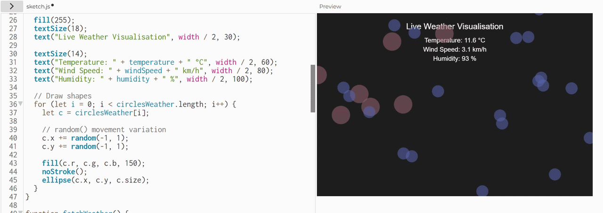
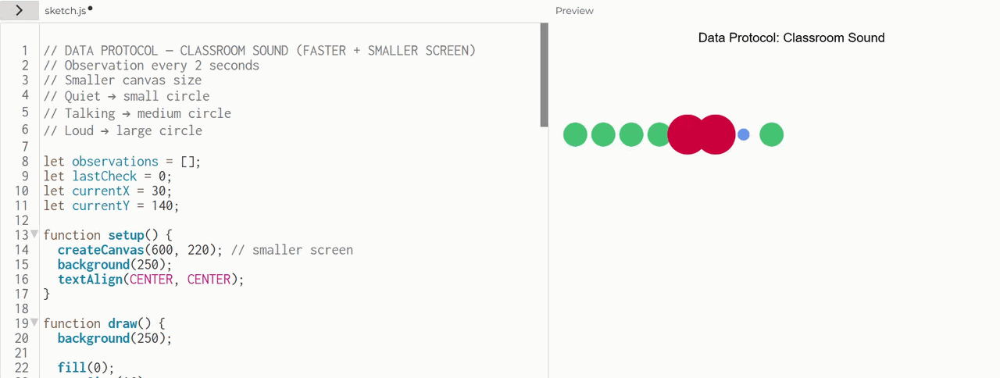
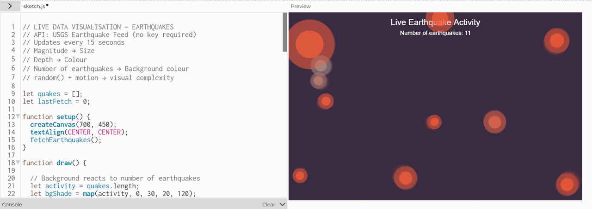

# Week 03

[← Back to Home](../index.md)

## Documentation 
## *Experiment 3: Live Data*

### Activity 1: Explore with cURL

For this activity we used the terminal to experiment with accessing live data from online sources. At first this felt quite confusing, as I had never used the terminal in this way before, but after trying a few different commands it started to make more sense. It felt a bit like talking directly to the internet and requesting specific information.

Some of the things I was able to explore included:

- Getting the weather for a location using coordinates
- Viewing the weather in a different language
- Finding the current moon phase
- Looking up synonyms and antonyms of a word

It was interesting to see how quickly information could be retrieved in a structured format. I realised that APIs are essentially a way for programs to communicate with each other, and that designers can use this data creatively rather than just displaying numbers.

This activity helped me understand that data is not just something static, it can be live, responsive, and constantly updating.

### Activity 2: Weather Visualisation

For this activity we opened a demo sketch in the p5.js editor that used live weather data. The sketch automatically retrieved weather information and translated it into visual elements on the screen.

I experimented by changing the location from Auckland to another city, and I noticed that the visual output changed depending on the weather conditions. This helped me understand how data values can be mapped to visual properties.

Some of the changes I experimented with included:

- Changing the colour of shapes based on temperature
- Adjusting the size of shapes depending on wind speed
- Increasing the number of shapes when humidity was higher
- Using random() to create more variation in movement

Using print() in the console was also helpful, as it allowed me to see the exact range of values before trying to visualise them. This made the mapping process feel more intentional rather than random.

Overall, this activity helped me understand how live data can be turned into something visual and expressive, rather than just numerical.

### Activity 3: Design and Execute a Data Protocol

For this activity we worked in pairs to create a data protocol, a set of instructions that translates live data into physical marks or actions.

Our Data Protocol

Source:
Sounds in the classroom (talking, movement, or noise)

Mapping:

- If the room was quiet = draw a small circle
- If there was talking = draw a medium circle
- If there was loud noise = draw a large circle
- Each new observation was drawn next to the previous one
- The drawing continued for 10 minutes

We wrote these instructions clearly on a sheet of paper so that another group could follow them without asking questions.

After designing our protocol, we swapped instructions with another pair and followed their rules. It was interesting to see how different groups interpreted the same instructions slightly differently.

Some parts of the protocol were more ambiguous than we expected. For example, what one person considered “loud” was different from someone else’s interpretation. This showed me how important clarity and precision are when designing rule-based systems.

Instead of designing a finished image, we designed a process that generated the image. I found it interesting how the final drawing became a record of time and activity in the room. The longer we followed the protocol, the more the drawing grew and changed. It felt less like a single artwork and more like a living system.

(Random note: I just realised it kind of looks like that one kids story- a very hungry caterpillar.)

## Independent Study: Live Data Visualisation

Building on the in-class activities, I created a work that engages with live data (data that is ongoing and changing). 

Option A: Digital

For my independent study, I created a p5.js sketch that responds to live earthquake data using an external API. Instead of using the weather or ISS examples provided in class, I searched for my own data source and selected the USGS Earthquake API. This allowed me to explore how real-time environmental data can be translated into visual behaviour.

Source: https://earthquake.usgs.gov/earthquakes/feed/v1.0/summary/all_hour.geojson

I vibe coded using chatgpt, and the result was interesting, but didn't quite connect visually to the data. 

To improve it I gave it the prompt; "Please make the data visually relate and represent the live data with code. Think about 'What does the visualisation reveal about the data that numbers alone cannot?
How does the sketch change over time? What is the relationship between the data's rhythm and the visual rhythm?'"

In my new sketch, each earthquake is represented as a ripple that expands outward, similar to shockwaves produced by seismic activity. The magnitude of the earthquake controls how fast the ripple grows, meaning stronger earthquakes create more energetic visual movement. The sketch continuously updates over time, so the screen gradually fills with expanding waves depending on real-world activity.

This project helped me understand that data visualisation is not just about displaying numbers, but about revealing patterns and behaviour. The visual system shows the rhythm of earthquake activity as pulses of motion, making the data feel dynamic and alive rather than static.

The visualisation reveals the intensity and frequency of earthquake activity in a more intuitive way than numerical values alone. Expanding ripples make it easier to perceive energy, scale, and accumulation over time. Instead of reading individual magnitudes, the viewer can immediately sense how active the system is by observing the density and movement of waves on the screen.

The rhythm of the data is reflected in the timing and frequency of new ripples appearing on the screen. When more earthquakes occur, the visual rhythm becomes faster and more crowded. When activity is lower, the visual rhythm slows down. This creates a direct connection between real-world events and visual motion.

### Document Your Process
Reflection:

For my independent study and in-class activities, I primarily took a digital approach, using p5.js to visualise live data. This approach allowed me to experiment with dynamic, continuously updating data that could respond in real-time, which would be difficult to achieve with analogue or physical methods. The live data I worked with came from two main sources: weather data (via a public API) and earthquake activity (USGS Earthquake API). I accessed these sources using JavaScript fetch() requests, retrieving structured JSON data that could be mapped to visual elements in my sketches.

When deciding on the mapping between data and visual form, I focused on the relationship between data magnitude and visual intensity. For example, temperature affected color, wind speed affected size, and earthquake magnitude controlled ripple expansion. I aimed for a visual language that communicated scale and activity intuitively, so viewers could “feel” the data rather than just read numbers. My work communicates patterns and rhythms in the data that would be difficult to detect numerically. In the earthquake sketch, for example, the frequency and size of ripples reveal periods of high or low seismic activity. The rhythm of the visualisations directly mirrors the real-world temporal patterns in the data.

In my process, I used vibe coding and ChatGPT prompts to explore creative visual mappings. This helped me generate ideas and refine code. I learned that tools like LLMs can accelerate exploration, but the meaningful connection between data and visual output requires careful reflection and iteration. This approach relates closely to practitioners like David Bowen and Nathalie Miebach, who translate live or environmental data into visual or physical forms. Like Bowen’s responsive installations or Miebach’s weather sculptures, my sketches aim to reveal patterns and rhythms of natural phenomena through process-driven visual systems.

Given more time, I would develop interactive layers or multimodal outputs to further enhance the connection between data and sensory experience. I also reflected on how precision in defining data thresholds (like “loudness” or earthquake magnitude) affects the clarity of the resulting visual system.

## AI Usage Statement

*I used ChatGPT for prompting and brainstorming ideas for visual mappings, but experimentation, creative direction, and final visual design are my own work. AI was a supportive tool, not a substitute for my creative decisions.*
