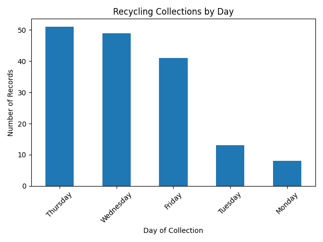

# Week 04

[← Back to Home](../index.md)

## Documentation 
## *Experiment 4: Artificial Intelligence*

### Activity 1: Local AI with Ollama
In this activity, I downloaded and ran the Qwen3:1.7b model locally on my computer using the terminal. I explored how a locally hosted AI responds to prompts about my previous experiments, asking for visualisation ideas and code snippets. Compared to cloud-based AI like ChatGPT, the experience felt slower but more intimate, since no data left my computer. I noticed limitations in depth and creativity, but the trade-off was full data privacy and control. This activity helped me appreciate that AI can be a tool for experimentation and ideation, but the output still requires human judgement to make meaningful, creative connections.

### Activity 2: Cloud AI with NotebookLM
Here, I created a NotebookLM notebook with my course work, practitioner sources, and personal observations. I framed the AI with a short context document describing my interests and curiosities. I then used the chat to analyse patterns, identify provocations, and propose design outcomes from my sources. Listening to the Audio Overview was particularly revealing: the AI highlighted unexpected connections and summarized my work in ways I hadn’t consciously noticed, though it occasionally misinterpreted or overlooked nuances. This showed me how AI can surface insights and gaps in my own thinking, but also reinforced that interpretation still needs a human perspective.

#### Overall Reflection
Both activities highlighted the practical and ethical trade-offs of AI. Local AI prioritizes sovereignty and privacy, while cloud AI offers richer analysis and synthesis. Engaging with these tools expanded my understanding of how AI can support creative design workflows without replacing human judgment, and emphasized the importance of curation, context, and reflection in using AI effectively.

## Independent Study: AI-Assisted Data Exploration

### Step 1: Find a Dataset

For this project, I explored the New Zealand open data catalogue and selected a dataset from the Christchurch City Council:

Dataset: Recycling Collection Open Data
Source: Christchurch City Council Open Data Portal
Link: https://opendata-christchurchcity.hub.arcgis.com/datasets/ChristchurchCity::recycling-collection-opendata/explore

I chose this dataset because it represents an everyday system that most people interact with but rarely think about in detail. Recycling collection is a routine part of urban life, yet it reflects a complex infrastructure involving logistics, policy decisions, and environmental priorities.

### Step 2: Understand the Data

After uploading the dataset into ChatGPT, I explored its structure and meaning through a series of prompts.

Output: "This dataset contains 165 rows and 9 columns, each representing a specific recycling collection schedule entry. At its core, it appears to document how a municipal recycling system operates over time. Each row is uniquely identified by a RecyclingCollectionID, which functions like a primary key and ensures that every record can be distinguished clearly. The dataset is relatively clean overall, with only small pockets of missing data, suggesting it was structured for operational or administrative use rather than exploratory analysis.

The columns describe different aspects of recycling collection. StatusDescription indicates whether a schedule is active or inactive, which helps track changes in services over time. TypeDescription refers to the type of recycling being collected, such as general recycling, organic waste, or glass, giving insight into how waste streams are categorized. StartTimeDescription specifies when collection begins, although a few entries are missing, suggesting either incomplete records or cases where timing is standardized and not explicitly recorded. FrequencyDescription explains how often collection occurs, such as weekly or fortnightly, which is particularly important for understanding service patterns and how they influence public behaviour.

Other columns provide more detailed scheduling information. ScheduleDescription offers a human-readable explanation of the schedule, like “every second Monday,” while WeekNumber indicates where the collection falls within a multi-week cycle. DayDescription specifies the day of the week for collection, and ValidFrom records when a particular schedule became effective. These fields together create a temporal structure, allowing the dataset to capture not just what happens, but when and how it changes. However, there are small gaps across these columns, including missing values in start times, schedule descriptions, week numbers, days, and validity dates, which introduce minor inconsistencies.

From a data quality perspective, the dataset is fairly robust but not perfectly standardised. Some fields rely on descriptive text rather than structured formats, which can make analysis more difficult. The absence of strict formatting suggests the data may have been designed for internal use or public readability rather than computational efficiency. Despite this, the dataset still provides a strong foundation for understanding service patterns.

Looking beyond the structure, the dataset tells subtle but compelling stories. It reflects the rhythms of a city’s infrastructure—how waste collection is scheduled in alignment with weekly routines and operational constraints. Through the ValidFrom column, it is also possible to trace how recycling services evolve over time, revealing shifts in policy, sustainability priorities, or resource allocation. Although it does not include behavioural or environmental outcomes, it indirectly shapes them; the frequency and timing of collections influence how people manage their waste in everyday life.

There are also important limitations and biases. The dataset lacks geographic information, meaning it cannot reveal whether certain areas receive better or worse service. It also does not include data on waste volume or participation rates, so it cannot measure the effectiveness of the system. Additionally, the reliance on human-readable descriptions introduces ambiguity and reduces analytical precision. These gaps suggest that the dataset prioritises operational scheduling over deeper evaluation or equity analysis.

Overall, this data was most likely collected by a local government or municipal authority as part of an open data initiative. Its purpose is likely to support transparency, enable public access to recycling schedules, and integrate with digital services such as reminder apps. While it may seem straightforward, the dataset ultimately represents more than just logistics. It captures how an invisible system quietly organises daily life, shaping behaviours and routines at a city-wide scale, even though it was not designed with that narrative in mind."

### Step 3: Design Multiple Representations

My process of working with AI to generate visualisations was iterative and required active direction. The AI did not immediately produce a successful or meaningful output, which meant I had to refine both my prompts and expectations.

#### First Attempt: Code-Based Visualisation

Initially, I asked ChatGPT to generate a coded visualisation. However, this approach was unsuccessful. The AI repeatedly produced errors in the code, and although I attempted to troubleshoot, it struggled to correctly interpret and fix its own mistakes.

This revealed a limitation:

AI can generate code, but debugging is less reliable, especially when context builds over multiple errors.
It also showed that AI is not always effective for complex technical tasks without strong user oversight.

Because of this, I shifted my strategy.

Error Output:

#### Second Attempt: Basic Data Visualisation

I simplified my prompt to: “produce a visualisation of the data.” This resulted in a basic chart showing recycling collections by day.

Output:

What was interesting: The AI sorted days by highest frequency, rather than keeping the natural Monday–Friday order.

Design limitation: The output was conventional and generic.
It prioritised clarity but lacked creativity or narrative.
It also produced this output:

#### Third Attempt: Creative Non-Graph Visual

I then prompted: “create a visually creative and interesting visualization of the data without the use of simple graphs.”

Output:

This produced a poster-style visual, which was much more engaging.
What improved: Use of metaphor and storytelling, visually appealing layout, less reliance on standard chart formats

What was missing: The actual data points were unclear and it communicated a theme (recycling system), not the specific dataset

#### Fourth Attempt: Directed Refinement

I gave more specific instructions:

"I like the creative usage in this, but please use this but make it easier to understand the data points while keeping the unique visuals. Keep the colour theme to the colour of recycling bins."

This improved visual cohesion (green, blue, yellow bins), but still leaned toward generic recycling imagery rather than the dataset. 

I loved ths visuals, but I wasn't showing the data points clearly, simply showing the 'recycling journey.' My next prompt was  "this is visually appealing but please show case the data points I have provided, eg. monday vs tuesday etc."

I am happy with this final visual, as I think I needed to be clearer on my prompting, and took AI a few tries to refine to my desired output. The process became less about “asking” and more about directing a design collaborator.

### Step 4: Critically Evaluate

Throughout the process, the AI consistently defaulted to familiar and conventional forms of data visualisation, particularly bar charts, simple layouts, and standard blue or green colour schemes. These outputs prioritised clarity and efficiency but lacked originality and did not fully engage with the uniqueness of the dataset. The AI also tended to generate generic titles and assume that the goal was to present straightforward quantitative comparisons, rather than exploring the data more creatively or contextually. This revealed how AI systems are often trained on dominant visual conventions, which can limit their ability to produce more experimental or interpretive designs without guidance.

To achieve more meaningful outputs, I had to actively override and redirect the AI’s decisions. This included specifying that I did not want traditional graphs, asking for more visually creative formats, and insisting that the final designs clearly communicate the actual data points rather than general recycling themes. I also guided the colour palette to align with familiar recycling bin colours, which helped create a stronger visual connection to the subject matter. Most importantly, I had to repeatedly push the AI to focus on the dataset itself, as it often drifted toward generic environmental imagery instead of representing the specific information I had provided.

The most successful representation was the final visual, which combined creative elements with clearer communication of the data. This version stood out because it balanced aesthetic appeal with informative content, using visual metaphors such as recycling bins to encode differences between days while still making the data understandable. It was more engaging than the initial chart while still allowing for meaningful comparisons, such as differences between Monday and Friday collections. This demonstrated the importance of iteration and refinement when working with AI, as the strongest outcome emerged only after multiple rounds of feedback and adjustment.

If I were creating this visualisation without AI, I would approach the process differently by spending more time analysing and restructuring the dataset before designing a visual system. I would likely develop a more intentional mapping between data and visual elements, possibly incorporating geographic information or temporal changes over time. While AI allowed me to quickly explore multiple design directions, it also required constant correction, and I had to take on a strong editorial role to ensure the outputs were both accurate and meaningful.

### Reflection:

I chose the Christchurch recycling collection dataset because it represents an everyday system that is often overlooked but plays an important role in shaping how people interact with sustainability practices. I was interested in how something as routine as bin collection could reveal underlying patterns in infrastructure and daily life. The dataset provided a structured way to explore these patterns, while also raising questions about how cities organise services and how those decisions influence behaviour.

AI tools were helpful in building an initial understanding of the dataset, particularly in explaining the structure of the columns, identifying patterns such as the dominance of fortnightly collections, and highlighting inconsistencies or missing values. However, the AI tended to focus on surface-level interpretation and did not fully engage with the broader social or cultural implications of the data. It did not question why the data was structured in a particular way, nor did it address what might be missing, such as geographic or demographic information. This meant that while the AI was useful for technical understanding, deeper critical analysis still relied on my own interpretation.

In directing the AI, I made several key design decisions, including moving away from standard graph formats, emphasising creative visual storytelling, and ensuring that the final output still clearly represented the data. I also chose to use recycling bin colours as a visual encoding strategy, which helped connect the design to the subject matter. Through this process, I learned that AI requires clear and specific instructions, and that effective use of AI involves iteration and refinement rather than expecting a perfect result from a single prompt. It also highlighted the importance of being able to critically evaluate and adjust AI outputs.

The different representations of the dataset significantly changed how the information could be understood. The initial graph made patterns easy to identify but felt impersonal and conventional. The more creative visuals were engaging and visually interesting, but at times obscured the actual data. The final representation achieved a balance between these approaches, showing that the way data is presented can shape not only what information is visible, but also how it is interpreted and valued by an audience.

The ideas presented by D’Ignazio and Klein in Data Feminism raise important questions about power, bias, and representation in data. Applying their perspective to this dataset highlights the absence of geographic and social context, which makes it difficult to assess issues such as equity in service provision. It prompts questions about whose needs are being prioritised and whose experiences are not captured. The dataset reflects institutional priorities, focusing on operational efficiency rather than community impact, which aligns with their argument that data is never neutral.

Kirikowhai Mikaere’s discussion of Māori data sovereignty further challenges how this dataset is understood. By framing data as a strategic asset for Māori development, it raises questions about ownership, control, and benefit. The dataset is produced by a government authority and made publicly available, but it does not reflect Māori perspectives or priorities, nor does it indicate how the data might support Māori communities. This highlights a gap between the concept of open data and the need for culturally informed and community-driven data practices.

Overall, my experience of working with AI as a design tool was both challenging and valuable. While the AI was capable of generating a wide range of outputs quickly, it often relied on generic patterns and required significant guidance to produce meaningful results. This reinforced the idea that AI should be used as a collaborative tool rather than an autonomous creator. With more time, I would develop the project further by incorporating additional layers of data, such as geographic distribution or environmental impact, and by creating a more refined and intentional visual system. This project ultimately demonstrated that data visualisation is not just about presenting information, but about making decisions that shape how that information is understood.

## AI Usage Statement

*I used ChatGPT for prompting and brainstorming ideas for visual mappings, but experimentation, creative direction, and final visual design are my own work. AI was a supportive tool, not a substitute for my creative decisions.*