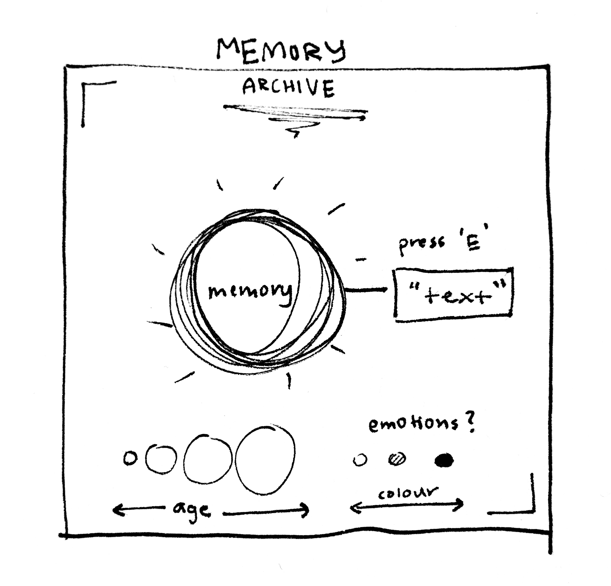
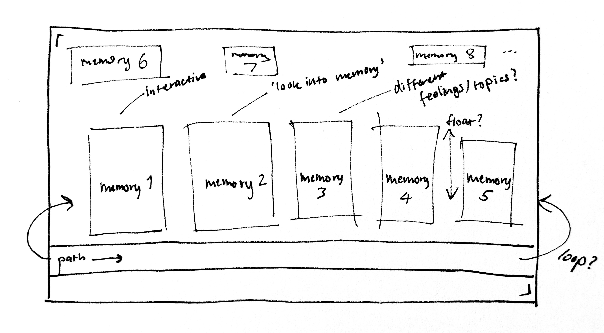

# Week 06

[← Back to Home](../index.md)

## Documentation 

## 1. Data Exploration

### Data Source Audit

For this project I decided to move away from my original proposal direction, which focused on anxiety and mental health. While I was interested in the topic, I struggled to identify a data source that would allow me to create an engaging interactive experience within the available timeframe. I found myself repeatedly thinking about how I would visualise anxiety in a way that felt meaningful rather than simply presenting statistics.
Instead, I became interested in memory as a form of data. This connected strongly with my broader interests in storytelling, speculative design, identity, and emotional experiences. After researching potential datasets, I discovered HappyDB, a publicly available dataset containing over 100,000 happy memories submitted by participants. The dataset includes short written descriptions of positive life experiences alongside additional metadata such as age and emotional characteristics.

*HappyDB Website Screenshot*

The dataset contains thousands of individual memory entries in CSV format. Each memory functions as a small snapshot of a person's life, ranging from family moments and friendships to achievements and exercise-related experiences. One limitation of the dataset is that it only captures positive memories, meaning it does not represent the full spectrum of human experience. Additionally, memories are written by participants and therefore vary significantly in length, detail, and emotional depth. Despite these limitations, the dataset aligned well with my project because it allowed me to explore memory as a collection of human experiences rather than simply numerical information.
After exploring the dataset, I decided to use artificial intelligence to curate approximately 50 memories rather than attempting to visualise the entire database. This made the project more achievable while still preserving the diversity of experiences represented within the data. The memories were grouped into four categories: Family, Friends, Achievement, and Exercise.

*Curated data from HappyHB*

## 2. Visual Research and Precedent Study

### Reference 1: Dear Data

What drew me to this project was its focus on personal experiences rather than large-scale statistics. The visualisations feel human and emotional despite being data-driven.
I wanted to carry forward the idea that data can communicate lived experiences rather than simply displaying numbers. This reinforced my interest in treating memories as meaningful human stories.

### Reference 2: Refik Anadol – Data Sculptures

I was interested in how data could be transformed into immersive spatial experiences rather than traditional graphs. The work creates a sense of scale and wonder through visualisation.
This reinforced my desire to create an environment that audiences could explore rather than a static image.

### Reference 3: Museum and Archive Spaces

I researched archive and museum environments because I wanted viewers to feel as though they were exploring stored memories. I was particularly interested in the atmosphere created through lighting and spatial arrangement.
This helped me begin thinking about the project as a "memory archive" rather than a conventional visualisation.

### Reference 4: Interactive Installations

Interactive installations demonstrated how simple interactions can create stronger emotional engagement. Rather than displaying information immediately, visitors discover information through movement and exploration.
This encouraged me to design a system where memories are revealed through interaction with data objects.

### Reference 5: Unreal Engine Environmental Art

I researched environmental design within Unreal Engine to understand how lighting, atmosphere, and composition could influence the viewer's experience.
This reinforced my decision to use Unreal Engine despite my limited experience with the software.

## 3. Project Planning and Skills Roadmap

####  3.1 What do I need to make?
I sketched an initial concept for a Memory Archive. The idea was to place memory data within a large immersive space where each memory would be represented by a floating orb. Viewers would navigate the environment and interact with the orbs to reveal individual memories.

*Memory Archive initial sketch* 

Annotations:

- Orbs represent individual memories.
- Colour represents memory category.
- Size represents age.
- Text appears through interaction.
- Environment functions as a visual archive of collective human experiences.

#### 3.2 What do I need to learn?
Priority 1:
Unreal Engine Blueprint interactions

Priority 2:
Unreal Engine UI widgets

Priority 3:
Importing and organising 3D assets

Priority 4:
Environmental lighting and atmosphere

Priority 5:
Data organisation and management

#### 3.3 What are my next steps?
My next step is to begin prototyping the archive environment within Unreal Engine. This will involve learning the basic workflow of importing assets, creating interactions, and displaying memory information through UI elements. I also need to finalise the subset of memories I will use from HappyDB and determine how different data attributes will be represented visually. Because I have limited experience with Unreal Engine, a large focus will be on technical experimentation and skill development. I expect that early prototypes will be simple, but they will help me identify what is achievable within the project timeframe. My goal is to create a functioning proof of concept that demonstrates how memory data can be transformed into an immersive interactive experience.

## Independent Study
### Consultation Reflection
Although my initial proposal focused on anxiety and mental health, reflecting on the project direction helped me realise that I was more interested in creating an experience centred around memory and emotional storytelling. The most useful insight from this process was recognising that not all datasets are equally suitable for interactive visualisation. While anxiety was conceptually interesting, I struggled to imagine a clear interactive form. In contrast, memory data immediately suggested opportunities for exploration, discovery, and interaction. This reflection helped me shift my focus toward creating a memory archive using HappyDB. As a result, I became more interested in how data can represent human experiences and emotions rather than simply communicating information. Moving forward, I plan to focus on creating an immersive environment that encourages curiosity and reflection.

Technical Skill Building
Because Unreal Engine was my highest-priority skill gap, I spent time learning the software and becoming familiar with its interface.
Initially, I found Unreal Engine extremely overwhelming compared to programs I had used previously. The large number of tools, menus, and systems made it difficult to know where to begin. However, after following several beginner tutorials, I became more comfortable navigating the editor and creating simple scenes. This process helped me understand the basic workflow required for building the project and gave me confidence to begin creating a prototype environment.

Initial Concept Sketch
Using my planning sketches, I developed a more detailed concept showing how memories could exist as floating data objects within an archive environment.

*Enviroment sketch of memory capsule*

This sketch helped me move beyond abstract ideas and begin considering specific design decisions such as layout, colour coding, interaction methods, and environmental atmosphere. It also confirmed that a spatial visualisation would be more engaging than a traditional chart-based approach.

## AI Usage Statement

*I used ChatGPT to support the writing process for this proposal by helping me organise my ideas, refine wording, and structure my reflections clearly. The core ideas, topic selection, and project direction are my own. AI was used as a brainstorming and editing tool, but all decisions about the content and design concept were made independently by me.*
