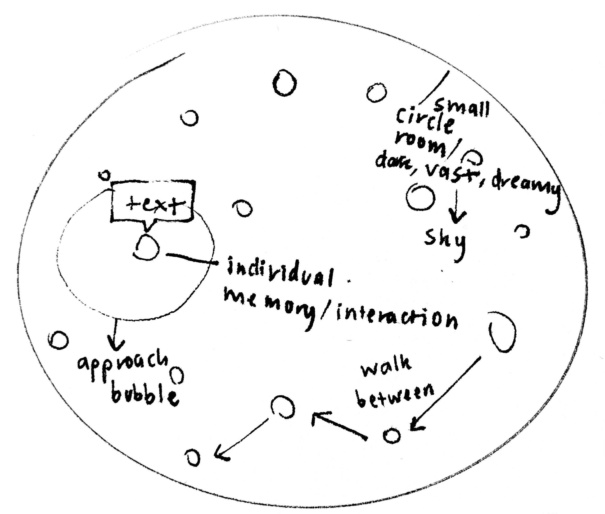

# Week 07

[← Back to Home](../index.md)

## Documentation 

## 1. Concept Development
Building on the initial Memory Archive concept from Week 6, I began thinking more carefully about how the environment itself could communicate the data. I wanted the project to feel less like a database and more like an explorable space where viewers could discover memories through movement and interaction.
One of the challenges I encountered was balancing the amount of information contained within the dataset with the limitations of the project. HappyDB contains thousands of memories, but attempting to visualise all of them would make the project overwhelming and difficult to navigate. Instead, I continued refining my decision to curate approximately 50 memories from four categories: Family, Friends, Achievement, and Exercise.
I also started exploring how different attributes within the data could be represented visually. Rather than displaying raw numbers, I wanted the environment itself to become the visualisation. I developed a simple mapping system:

- Colour = Memory category
- Size = Age
- Interaction = Memory text
- Position = Cluster grouping

This helped transform the dataset from a spreadsheet into something spatial and immersive.

## 2. Concept Sketch Development
After refining the concept, I produced a second set of sketches exploring possible layouts for the archive.
The first sketches experimented with placing memories in a large open environment. However, I realised that this could make the space feel empty and difficult to navigate. I therefore began investigating circular layouts that would naturally guide viewers through the different memory clusters.
The circular arrangement also reinforced the idea of memories existing within a shared archive rather than being isolated data points.

*Memory archive layout sketch*

Reflecting on the sketches, I found that simplifying the environment actually strengthened the project. Rather than creating a large complex world, I could focus on atmosphere, interaction, and data representation.

## 3. Making Sprint
My first practical experiment involved building a prototype environment in Unreal Engine.
Initially, I located an interesting architectural model online that resembled a futuristic concrete structure. I imagined this space functioning as a memory archive where visitors could move between different memory clusters.

*Enviroment on sketchfab imported into Unreal Engine*

However, after importing the asset into Unreal Engine, I encountered a significant problem. While the model appeared visually impressive, I was unable to move through the structure as intended. After spending a considerable amount of time troubleshooting, I eventually discovered that the environment had been heavily baked and functioned more like a static object than a usable interactive space.
This was frustrating because I had already invested a substantial amount of time attempting to understand why the environment was not working correctly. However, the experience taught me the importance of testing assets early before committing to them as part of a design direction.

## 4. Exploring Alternative Directions
Rather than abandoning the project, I began searching for alternative approaches.
I realised that creating my own environment would provide far greater control and flexibility. During this process I found a simple circular architectural model on Sketchfab. The structure was much cleaner and more minimal than the original environment.
What attracted me to this model was its simplicity. Instead of distracting viewers with architectural complexity, it could function as a neutral container for the memory data itself.

*Enviroment in Unreal Engine, retrieved from sketchfab*

After importing the model into Unreal Engine, I modified and simplified aspects of the structure to better match the visual atmosphere I wanted to create. This immediately felt more successful than the previous environment.

## 5. 'What If' Variations
Although I was unable to participate in the in-class discussion activity, I independently explored several alternative directions for the project.
### Variation 1 – Infinite Memory Archive
Instead of a contained room, the archive could exist within an infinite void filled with thousands of memories.
- Potential benefit:
Greater sense of scale.
- Limitation:
Unrealistic within project constraints.

### Variation 2 – Timeline-Based Memories
Memories could be organised chronologically rather than by category.
- Potential benefit:
Clearer representation of time.
- Limitation:
Less visually engaging.

### Variation 3 – Emotional Landscape
Memories could generate terrain based on emotional intensity.
- Potential benefit:
Strong environmental storytelling.
- Limitation:
Significant technical complexity.

After exploring these alternatives, I decided that the archive room remained the strongest direction because it balanced conceptual clarity, technical feasibility, and visual impact.

## Independent Study
### Project Development & Skill Building
The primary focus of my independent study this week was becoming more comfortable within Unreal Engine.
Because I had never worked extensively with Unreal before, even simple tasks often required significant experimentation and troubleshooting. However, I gradually became more confident with importing models, organising scenes, navigating the editor, and adjusting materials.
One important lesson I learnt was that choosing the right asset is often just as important as learning technical skills. The time I spent trying to force the original concrete environment to work demonstrated how easy it is to lose momentum when committing to unsuitable assets.
Despite these challenges, I finished the week with a functioning archive environment and a much clearer understanding of the project's visual direction.

### Progress Report
At this stage the project had progressed from an abstract idea into an early Unreal Engine prototype.
#### Key developments:
- Selected HappyDB as the primary dataset.
- Curated approximately 50 memories.
- Established four memory categories.
- Developed visual mapping system.
- Experimented with multiple environment concepts.
- Selected a circular archive space as the primary environment.
#### Questions I was continuing to explore:
- How should memories be represented visually?
- How can interaction reveal data effectively?
- What atmosphere best supports the archive concept?

Overall, this week helped transform the project from a conceptual proposal into a tangible prototype and established a clear foundation for future development.

## AI Usage Statement

*I used ChatGPT to support the writing process for this proposal by helping me organise my ideas, refine wording, and structure my reflections clearly. The core ideas, topic selection, and project direction are my own. AI was used as a brainstorming and editing tool, but all decisions about the content and design concept were made independently by me.*